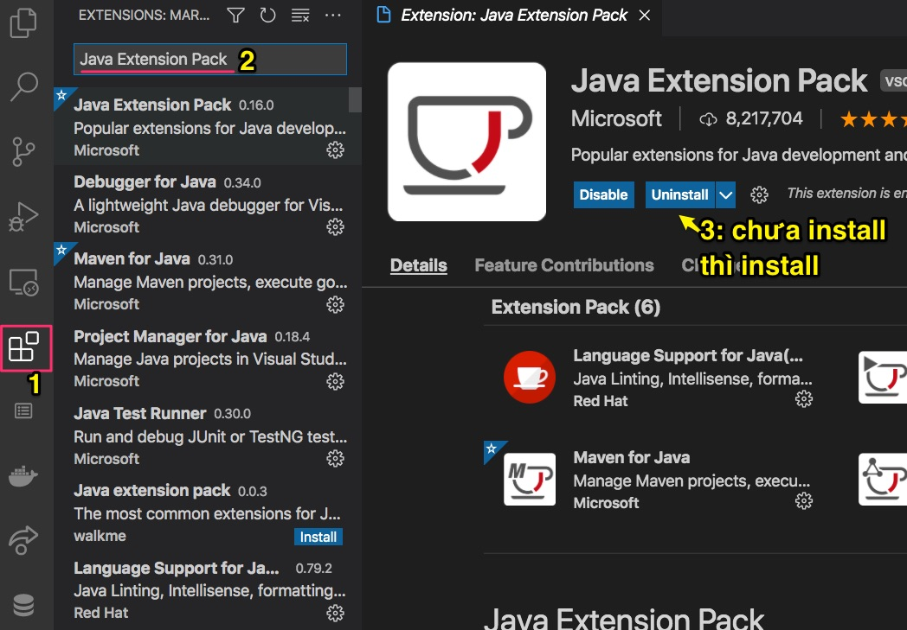
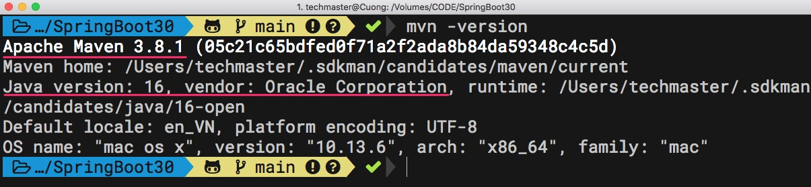

# Chuẩn bị môi trường lập trình Java Spring Boot

## 1. Cài đặt Java JDK

Cách 1: Phổ biến nhất tại thời điểm viết bài này 15/6/2021, các bạn nên cài phiên bản [Oracle JDK 16](https://www.oracle.com/java/technologies/javase-jdk16-downloads.html)

Cách 2: Nếu bạn muốn sử dụng đồng thời nhiều phiên bản SDK trên cùng một máy tính, thì cần cài [SDKMan](https://sdkman.io/). Việc cài đặt SDKMan trên Mac và Linux rất đơn giản. Còn trên Windows bạn cần phải cài trước đó [Windows Sub System for Linux](https://docs.microsoft.com/en-us/windows/wsl/install-win10)

Hướng dẫn [Làm thế nào để dùng nhiều phiên bản JDK trên một máy tính mà không xung đột](https://techmaster.vn/posts/36415/lam-the-nao-de-dung-nhieu-phien-ban-jdk-tren-mot-may-tinh-ma-khong-xung-dot)

## 2. Cài đặt VSCode Extension

1. Cài đặt [Java Extension Pack](https://marketplace.visualstudio.com/items?itemName=vscjava.vscode-java-pack)
2. Cài đặt [Spring Initializr Java Support](https://marketplace.visualstudio.com/items?itemName=vscjava.vscode-spring-initializr)


   
## 3. Cài đặt Apache Maven
Maven là công cụ quản lý các thư viện cho ứng dụng Spring Boot
[Apache Maven](https://maven.apache.org/)

Xem video [Spring Boot #1: Quản lý project Java với Maven thần thánh](https://www.youtube.com/watch?v=9oJct_kCMkU)

Sau đó mở Terminal (Linux, Mac) hoặc Powersell (trong Windows) gõ lệnh
```
mvn -version
```
Kết quả tương tự như hình dưới
