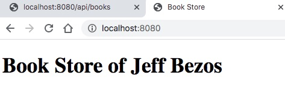

# Server Side Rendering

Server side rendering web application là ứng dụng web ở đó web application sẽ sinh mã HTML ngay tại server và trả về cho trình duyệt.

Ưu điểm của Server side rendering là:

1. Tối ưu về SEO (Search Engine Optimization)
2. Có thể sử dụng caching phía server
3. Lập trình kiểu truyền thống, dễ dàng debug gỡ rối

Sau đây là các bước thực hành
## 1. Tạo project sử dụng maven làm thư viện quản lý dependencies

Dependency có nghĩa là thư viện mà ứng dụng Spring Boot sẽ phải phụ thuộc. Maven là công cụ quản lý phiên bản thư viện, các plugin
phục vụ quá trình biên dịch. Maven sử dụng file cấu hình XML pom.xml. Song song với Maven có Gradle có chức năng tương tự. 
Gradel hiện đại hơn, biên dịch nhanh hơn, nhưng lại ít phổ biến hơn. Trong lớp học này 80% ví dụ sẽ dùng Maven, còn lại chuyển qua dùng Gradle.

File [pom.xml](pom.xml) cần chứa 3 dependencies : ```spring-boot-starter-thymeleaf, spring-boot-starter-web, spring-boot-devtools```
```xml
<dependency>
  <groupId>org.springframework.boot</groupId>
  <artifactId>spring-boot-starter-web</artifactId>
</dependency>
<dependency>
  <groupId>org.springframework.boot</groupId>
  <artifactId>spring-boot-devtools</artifactId>
  <scope>runtime</scope>
  <optional>true</optional>
</dependency>
<dependency>
  <groupId>org.springframework.boot</groupId>
  <artifactId>spring-boot-starter-thymeleaf</artifactId>
</dependency>
```

Ý nghĩa và tác dụng của từng dependency như sau:
1. ```spring-boot-starter-web```: thư viện web căn bản quan trọng trong Spring Boot
2. ```spring-boot-devtools```: nice to have (nên có) để tự động biên dịch, khởi động lại Spring Boot khi lập trình viên thay đổi mã
3. ```spring-boot-starter-thymeleaf```: view template engine để kết hợp với dữ liệu sinh ra mã HTML tại server

## 2. Cấu trúc thư mục dự án
```
.
└── book
    ├── .mvn  <-- File dành riêng cho Maven chạy khi biên dịch, đóng gói ứng dụng. Đừng động vào
    ├── .settings <-- Cấu hình riêng của dự án đừng động vào
    ├── .vscode <-- Cấu hình của VSCode. Chỉ được sinh ra khi bạn dùng VSCode mở dự án
    │   └── launch.json <-- Cấu hình biên dịch và debug do VSCode sinh ra khi bạn cấu hình
    ├── src <-- Chứa mã nguồn dự án
    │   ├── main
    │   │   ├── java
    │   │   │   └── vn
    │   │   │       └── techmaster
    │   │   │           └── book  <-- Tên dự án là book (artifactid = `book`)
    │   │   │               ├── controller  <-- Controller trong mô hình MVC để xử lý request trả về response
    │   │   │               │   └── BookController.java
    │   │   │               ├── model <-- Mô tả cấu trúc dữ liệu 
    │   │   │               │   └── Book.java
    │   │   │               └── BookApplication.java <-- Class chính chứa hàm main để khởi động Spring Boot
    │   │   └── resources <-- Chứa các file tài nguyên tĩnh
    │   │       ├── static
    │   │       ├── templates <-- Chứa các View template kết hợp mã HTML và Thymeleaf Syntax
    │   │       │   ├── book.html
    │   │       │   └── index.html
    │   │       └── application.properties <-- Chứa thông tin cấu hình ứng dụng Spring Boot
    │   └── test <-- Thư mục kiểm thử
    │       └── java
    │           └── vn
    │               └── techmaster
    │                   └── book
    │                       └── BookApplicationTests.java
    ├── target  <-- Chứa các file class được biên dịch ra
    │   ├── classes
    │   │   ├── templates
    │   │   │   ├── book.html
    │   │   │   └── index.html
    │   │   ├── vn
    │   │   │   └── techmaster
    │   │   │       └── book
    │   │   │           ├── controller
    │   │   │           │   └── BookController.class
    │   │   │           ├── model
    │   │   │           │   └── Book.class
    │   │   │           └── BookApplication.class
    │   │   └── application.properties
    │   └── test-classes
    │       └── vn
    │           └── techmaster
    │               └── book
    │                   └── BookApplicationTests.class
    ├── .classpath
    ├── .gitignore  <-- Cấu hình git bỏ qua một số file, thư mục không cần quản lý phiên bản
    ├── .project
    ├── HELP.md
    ├── mvnw
    ├── mvnw.cmd
    ├── pom.xml <-- Cấu hình Maven
    ├── ReadMe.md <-- Hãy luôn ghi chép lại những gì bạn đã làm trong dự án
```

## 3. Tạo trang home page đơn giản
Ban đầu file [BookController.java](src/main/java/vn/techmaster/book/controller/BookController.java) chỉ đơn giản như vậy thôi

```java
package vn.techmaster.book.controller;

import org.springframework.stereotype.Controller;
import org.springframework.web.bind.annotation.GetMapping;
import org.springframework.web.bind.annotation.RequestMapping;

@Controller
@RequestMapping(value ="/")
public class BookController {
  @GetMapping("/")
  public String showHomePage() {
    return "index";  //Hãy hiển thị file index.html trong thư mục /resources/templates/
  }
}
```

File HTML template [index.html](src/main/resources/templates/index.html) đây 
```html
<!DOCTYPE html>
<html lang="en">
<head>
  <meta charset="UTF-8">
  <meta http-equiv="X-UA-Compatible" content="IE=edge">
  <meta name="viewport" content="width=device-width, initial-scale=1.0">
  <title>Book Store</title>
</head>
<body>
  <h1>Book Store</h1>
</body>
</html>
```

Hãy biên dịch chạy thử nhé.

## 4. Trải nghiệm tính năng Hot Reload của Devtools

Hãy thử sửa
**BookController.java**
```java
public String showHomePage(Model model) {
  model.addAttribute("name", "Jeff Bezos");
  return "index";
}
```
**index.html**
```html
<body>
  <h1 th:text="|Book Store of ${name}|"></h1>
</body>
```
Chỉ cần refresh lại trình duyệt thấy ngay kết quả
