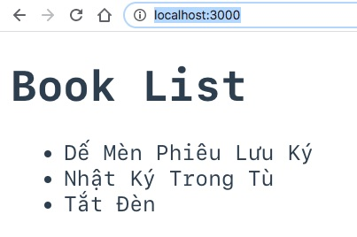

# 1. Client Side Rendering tổng quan

Ở bài số 1, chúng ta làm quen với Spring Boot tạo ra một ứng dụng web cổ điển Server Side Rendering. Bạn vẫn còn nhớ Thymeleaf View Template Engine đấy chứ.

Ở bài này, chúng ta chơi nổi một chút, chuyển qua Client Side Rendering. Tại sao gọi là Client Side Rendering? Bởi vì phía server là Spring Boot application không tạo ra giao diện mà chỉ trả về (response) định dạng JSON.


Việc hiển thị như thế nào là việc của client. Client ở đây có thể là trình duyệt hoặc ứng dụng di động. Smart phone ra đời khiến cho mô hình web truyền thống (server side rendering) khó cạnh tranh. Nếu vẫn dùng server side rendering thì cùng một lúc bạn vừa phải code giao diện HTML View Template và vừa phải tạo ra đủ REST API phục vụ cho ứng dụng di động.


# 2. Chạy ví dụ trong bài

Tôi tạo ra hai thư mục :
1. book: ứng dụng Spring Boot lắng nghe ở cổng 8080
2. bookvue: ứng dụng Vuejs (v3) lắng nghe ở cổng 3000

## 2.1 Chạy thử bằng command line

1. Chuyển vào thư mục book: `cd book`
2. Gõ lệnh maven chạy Spring Boot: `mvn spring-boot:run`
3. Mở trình duyệt gõ `http://localhost:8080/api/books`
Bạn sẽ thấy dữ liệu json như sau trả về
```json
[
  {
    "title": "Dế Mèn Phiêu Lưu Ký",
    "author": "Tô Hoài"
  },
  {
    "title": "Nhật Ký Trong Tù",
    "author": "Hồ Chí Minh"
  },
  {
    "title": "Tắt Đèn",
    "author": "Ngô Tất Tố"
  }
]
```

4. Tiếp đến chúng ta chuyển đến thư mục bookvue bằng cách `cd bookvue`
5. Khởi động ứng dụng bằng `npm run dev`
6. Mở trình duyệt gõ `http://localhost:3000`



Cấu trúc ứng dụng Client Side để bạn dễ hình dung.
```
.
├── assets
│   └── logo.png
├── components
│   └── BookList.vue
├── App.vue
└── main.js
```
### Tìm hiểu kỹ hơn về Vue.js

1. Chúng ta dùng Node.js làm web server phục vụ Vue.js static files
2. Node.js có thể thay thế bằng Web server khác như Golang, Python, Java.... tuy nhiên cho mục đích phát triển, kiểm thử Node.js vẫn là tốt nhất vì nó hot reload
3. Node.js không nối vào REST API của Spring Boot. Thực tế Vue app nối vào REST API của Spring Boot

```js
methods: {    
  async fetchBooks() {
    try {
      this.error = null
      this.loading = true
      const url = `http://localhost:8080/api/books`
      const response = await axios.get(url)       
      this.books = response.data
    } catch (err) {       
      console.log(err)
    }
    this.loading = false
  },
},
```

Node.js có trình NPM (Nodes Package Management) cũng giống như Maven và Gradle trong Java.

File package.json tương đương file pom.xml của Maven.

`async fetchBooks()` trong JavaScript có nghĩa là đây là hàm non-blocking, nó có thể chạy dài hay ngắn nhưng sẽ không block thread chính của ứng dụng

`await axios.get(url)` chờ cho đến server trả về dữ liệu.

Điều thú vị await lại là blocking. Có nghĩa phải chờ cho đến khi kết quả trả về. Nhưng lệnh này nằm trong hàm `async` nên nó không ảnh hưởng đến các tác vụ khác.

Vue 3 chia ứng dụng thành các component. Trong mỗi compnent sẽ có template và logic. Component có thể chứa component.

Template trong Vue tương tự như template trong Thymeleaf
```html
<ul id="array-rendering">
  <li v-for="(book, index) in books" :key="index" :book="book">
    {{ book.title + book.author }}
  </li>
</ul>
```

với thymeleaf là
```html
<ul th:each="book : ${books}">
  <li th:text="|&quot;${book.title}&quot; : &quot;${book.author}&quot;|"></li>
</ul>
```

Bài tập tại lớp:

Hãy bổ xung book.author vào Vue 3. Google Vue string concatnate
## Hỏi và đáp

Hỏi: Lập trình Client Side Rendering có làm ứng dụng đẹp hơn?

Đáp: Không! Xấu hay đẹp do thiết kế. Server Side Rendering hay Client Side Rendering chỉ là cách thức lập trình thôi.

---

Hỏi: Để chạy Client Side Rendering trong ví dụ này, chúng ta đã sử dụng Node.js?

Đáp: đúng vậy. Ở chế độ Development, chúng ta sẽ sử dụng Node.js làm web server phục vụ Vue app.

---

Hỏi: Chúng ta có thể dùng Spring Boot để phục vụ ứng dụng Vue thay cho Node.js?

Đáp: Hoàn toàn được sau khi đóng gói ứng dụng Vue thành dạng distribution.

---

Hỏi: Thầy Cường có dạy chúng em lập trình Vuejs không?

Đáp: không. Tôi tập trung dạy Java - Spring Boot - Golang các công nghệ liên quan đến back end.
Phần lập trình front end, tôi sẽ dạy Server Side Rendering + Thymeleaf. Tôi dạy cả REST API.

Bạn muốn học Vue.js liên hệ cô Mẫn phụ trách đào tạo và thầy Huy. Phần Vue.js là phần nằm ngoài lộ trình Java Full Stack?

---
Hỏi: Nếu đi xin việc, nhà tuyển dụng yêu cầu em phải lập trình React thì sao?

Đáp: Thì học React và lập trình !

---

Hỏi: Vue.js dễ hơn hay Thymeleaf dễ hơn?

Đáp: Khi mới học thì Thymeleaf dễ hơn vì nó bổ xung cú pháp trực tiếp vào HTML không làm vỡ cú pháp HTML. Bạn chỉ cần chuẩn bị dữ liệu trong Controller rồi trả về tên file Thymeleaf view template.

```java
model.addAttribute("key", value);
return "template_file";
```

Ngược lại với Vue / React/ Angular bạn phải nắm vững JavaScript và cách thức lập trình của từng thư viện.

---

Hỏi: Ứ, em muốn học Client Side Rendering cơ. Thầy phải dạy em!

Đáp: Tuổi nhỏ làm việc nhỏ. Hãy tập trung học Java Spring Boot vững đã. Khi nào thành thạo liên hệ với thầy Huy.

---

Hỏi: Phong cách dạy của thầy sao lạ vậy? Mới buổi hai đã dạy cả Server Side Rendering rồi Client Side Rendering. Liệu đó có phải cách hay không?

Đáp: Tôi lập trình từ năm 1992. Hiện nay tôi chủ yếu đào tạo các nhóm fresher developer cho các doanh nghiệp. Tôi hiểu rõ doanh nghiệp cần gì. Tôi liên tục học hỏi, cải tiến phương pháp giảng dạy để:
* Phương pháp đào tạo ở Techmaster khác với cách dạy ở trường đại học. Nó khiến bạn ngạc nhiên. Nhưng đó cũng là lý do bạn chọn học ở Techmaster.
* Loại bỏ những nội dung rườm rà không cần thiết. Đi thẳng vào vấn đề.
* Nói chuyện bằng code, chứ không dùng lý thuyết suông.
* Liên hệ với ví dụ đời thường nhiều.
* Giảng viên code mẫu nhiều. Đổi lại sinh viên cũng phải lập trình nhiều.
* Khuyến khích sinh viên xây dựng hình thành nhóm học tập: hỗ trợ - giải thích cho nhau.
* Các sinh viên sẽ phải dịch bài để học cách đọc trực tiếp tài liệu tiếng Anh.

---

Hỏi: thầy có đảm bảo việc làm cho chúng em không?

Đáp: Techmaster chỉ cam kết việc làm khi bạn hoàn thành các bài tập lập trình và bảo vệ thành công đồ án tốt nghiệp.

Bạn không chủ động giúp chính bạn, chúng tôi sao giúp được bạn.


# Bài tập tại lớp.

Hãy chuyển đổi từ Book thành Film để làm quen một chút với Vuejs3

```
.
├── assets
│   └── logo.png
├── components
│   └── BookList.vue  --> FilmList.vue
├── App.vue
└── main.js
```
