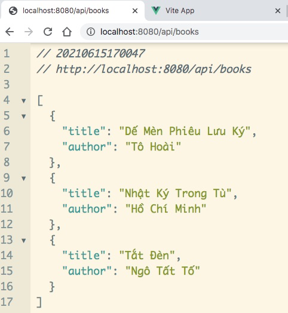
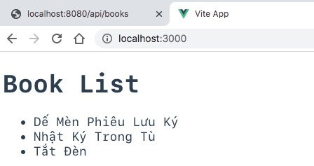

# Chạy ứng dụng Vue3 nối vào REST API do Spring Boot phục vụ

Cài đặt Node.js trên máy tính của bạn
Sau đó mở command line gõ lệnh
```
$ cd bookvue
$ npm run dev
```

Dữ liệu REST API trả về do ứng dụng Spring Boot phục vụ ở cổng 8080


Giao diện client side rendering viết bằng Vue.js 3
