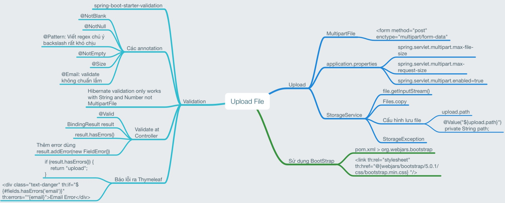

# File upload, validation và xử lý lỗi



## Cấu trúc thư mục
```
.
├── main
│   ├── java
│   │   └── vn
│   │       └── techmaster
│   │           └── demoupload
│   │               ├── controller
│   │               │   ├── UploadAPI.java
│   │               │   └── UploadController.java <-- Controller chính
│   │               ├── entity
│   │               │   └── Person.java <-- Model Person
│   │               ├── exception
│   │               │   └── StorageException.java <-- Custom Exception
│   │               ├── service
│   │               │   └── StorageService.java <--Lưu file vào thư mục quy định
│   │               └── DemouploadApplication.java
│   ├── resources
│   │   ├── static
│   │   │   ├── photos <-- Thư mục lưu file upload lên
│   │   │   │   └── rock.jpg
│   │   ├── templates
│   │   │   ├── error
│   │   │   │   └── 404.html
│   │   │   ├── failure.html
│   │   │   ├── success.html
│   │   │   ├── template.html
│   │   │   └── upload.html <-- File upload
│   │   └── application.properties <-- Cấu hình ứng dụng
```
## Upload

UploadController --> StorageService
```java
@Service
public class StorageService {
  @Value("${upload.path}")
  private String path;

  public void uploadFile(MultipartFile file) {

    if (file.isEmpty()) {
      throw new StorageException("Failed to store empty file");
    }

    String fileName = file.getOriginalFilename();    
    try {
      var is = file.getInputStream();
      Files.copy(is, Paths.get(path + fileName), StandardCopyOption.REPLACE_EXISTING);
    } catch (IOException e) {
      var msg = String.format("Failed to store file %s", fileName);
      throw new StorageException(msg, e);
    }
  }
}
```

Nếu có lỗi thì throw StorageException

Định nghĩa đường dẫn lưu file trong application.properties
```json
upload.path=src/main/resources/static/photos/
```

## Hiển thị lỗi
```java
@ExceptionHandler(StorageException.class)
  public String handleStorageFileNotFound(StorageException e, Model model) {
    model.addAttribute("errorMessage", e.getMessage());
    return "failure";
  }
```

## Customize thông báo lỗi

Tạo file báo lỗi 404 ở thư mục
resources > templates > error > 404.html

## Upload Binary

Hỏi: Tại sao khi upload file, web server luôn lưu ra file tạm ở thư mục temporary?

Đáp: Với những file có kích thước lớn, trình duyệt sẽ gửi file binary theo từng khúc (trunk), web server sẽ nhận từng trunk rồi ghép lại. File đang ghép dở sẽ là file tạm ở thư mục tạm. Khi nào ghép đầy đủ các khung, thì web server cần copy sang thư mục chỉ định.

---
## Validation
Hỏi: Server Side Validation khác gì Client Side Validation?

Đáp:
**Ưu điểm của Server Side Validation**
1. Chỉ viết logic validation một lần, nhưng áp dụng cho nhiều loại client kết nối.
2. Tính bảo mật tốt hơn vì đây là chốt chặn cuối cùng
3. Phù hợp triển khai các validation liên quan đến nghiệp vụ ứng dụng

**Nhược điểm của Server Side Validation**
1. Mất thời gian phản hồi từ server và giao diện người dùng
2. Ảnh hưởng đến performance chung, tạo áp lực lên server

**Ưu điểm của Client Side Validation**
1. Ở ngay trên giao diện của Client. Tốc độ phản hồi nhanh. Trải nghiệm người dùng tốt
2. Giảm rất nhiều những dữ liệu phạm quy gửi lên server
3. Khi số lượng client rất lớn, thì chạy logic validation ở client giảm bớt áp lực lên server

**Nhược điểm của Client Side Validation**
1. Có bao nhiêu công nghệ Client thì phải lập trình ngần đó validation
2. Không thống nhất, cập nhật các validation rule cho tất cả các nền tảng công nghệ: IOS, Android, Web
3. Chỉ phù hợp validate trường đơn giản, không validate được các nghiệp vụ phức tạp

### Hibernate Validation

Trong ví dụ này tôi sử dụng Server side Validation. Bản chất là dùng Hibernate Validation, tuy nhiên Spring Boot cung cấp package bao lấy Hibernate Validation là spring-boot-starter-validation
```xml
<dependency> 
  <groupId>org.springframework.boot</groupId> 
  <artifactId>spring-boot-starter-validation</artifactId> 
</dependency>
```
