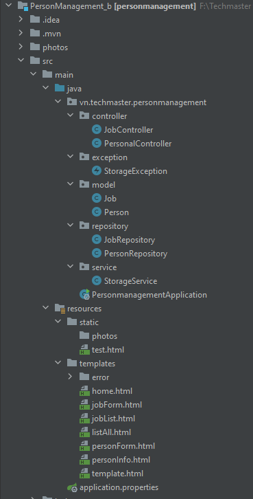
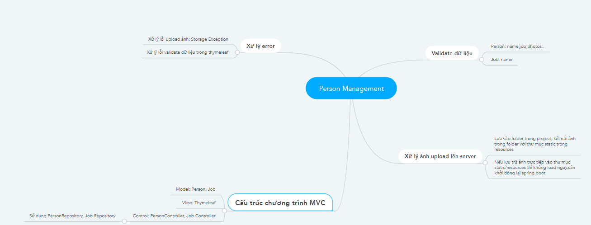
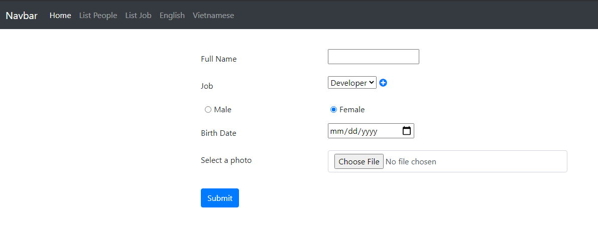
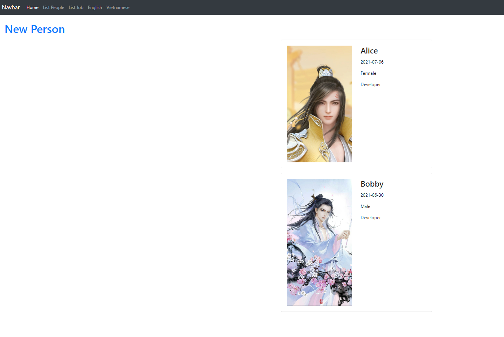
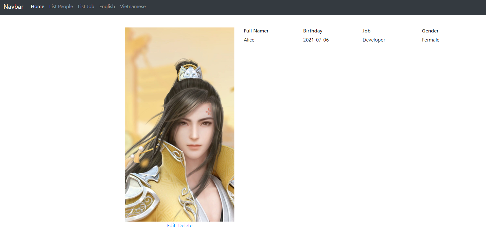
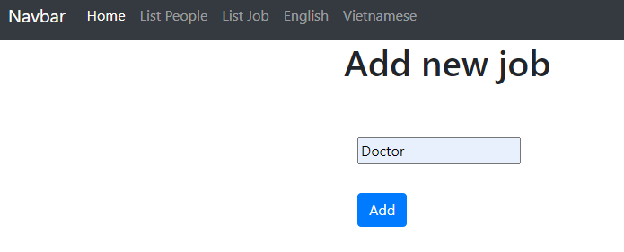

1. Cấu trúc chương trình
 
   

2. Chạy chương trình:
    Hompage:
        
    People List:
        
    People detail:
        
    Create Job:
        
        
   
Lưu ý: Khi upload ảnh lên server ta upload vào thư mục photos trong Project sau đó ghép nối thư mục static/photos vào thư mục photos