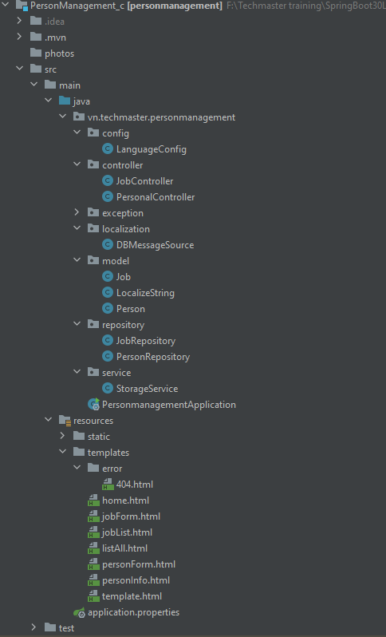
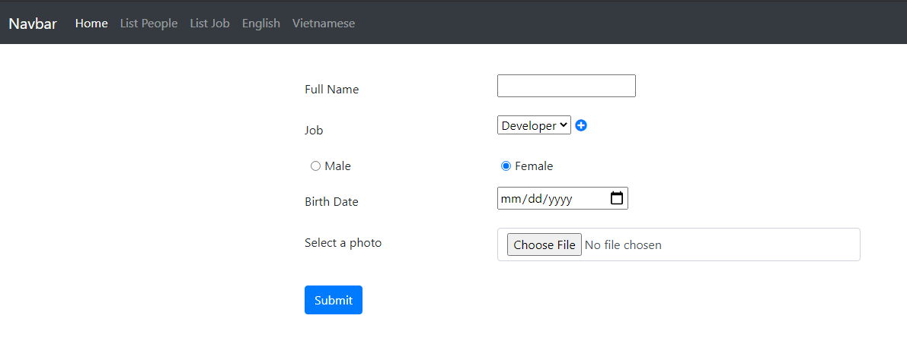
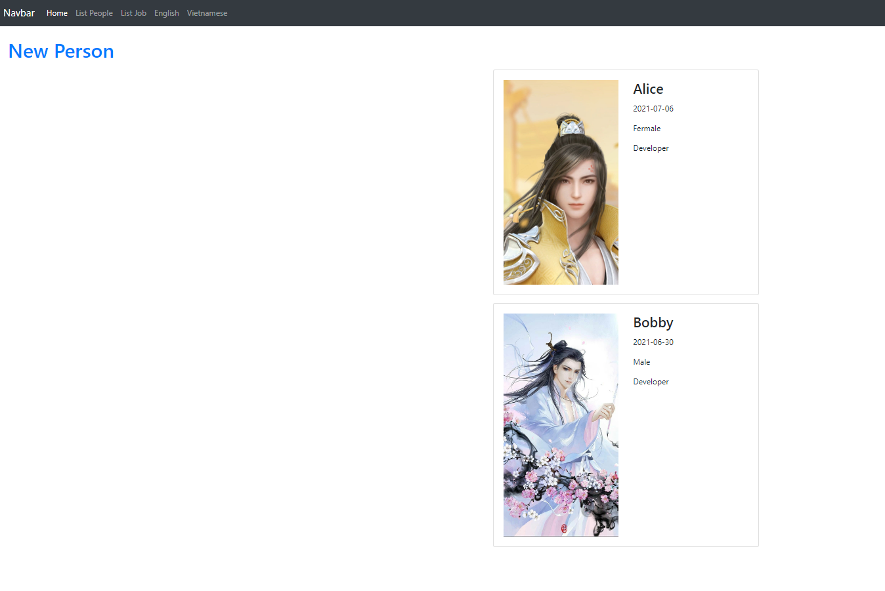
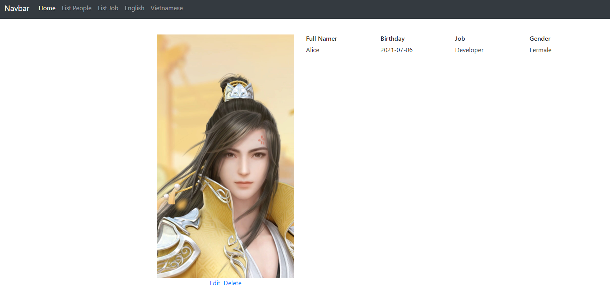
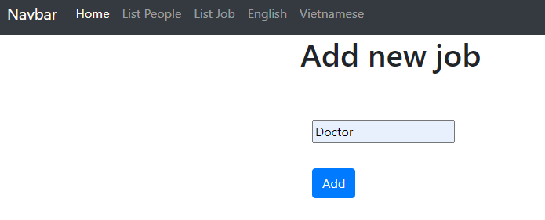
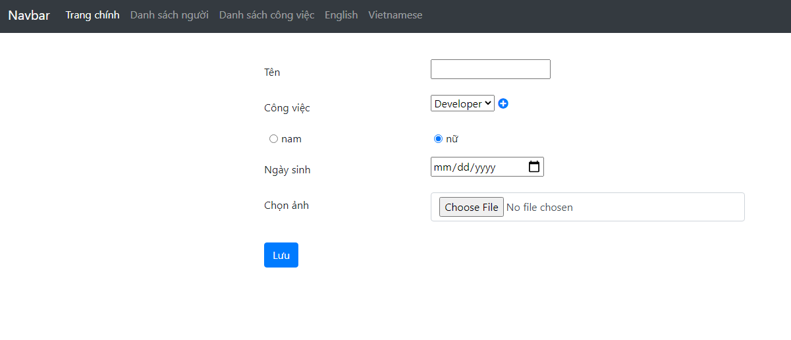
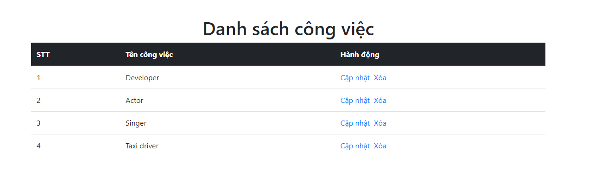

1. Cấu trúc chương trình
 
   
2. Chạy chương trình:
    Hompage:
        
    People List:
        
    People detail:
        
    Create Job:
        
   
    Translate:
        
        
        
        
        
   
