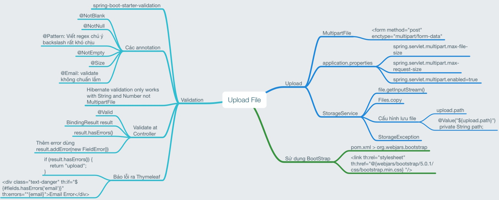

# File upload, validation và xử lý lỗi



## Cấu trúc thư mục
```
.
├── main
│   ├── java
│   │   └── vn
│   │       └── techmaster
│   │           └── demoupload
│   │               ├── controller
│   │               │   ├── UploadAPI.java
│   │               │   └── UploadController.java <-- Controller chính
│   │               ├── entity
│   │               │   └── Person.java <-- Model Person
│   │               ├── exception
│   │               │   └── StorageException.java <-- Custom Exception
│   │               ├── service
│   │               │   └── StorageService.java <--Lưu file vào thư mục quy định
│   │               └── DemouploadApplication.java
│   ├── resources
│   │   ├── static
│   │   │   ├── photos <-- Thư mục lưu file upload lên
│   │   │   │   └── rock.jpg
│   │   ├── templates
│   │   │   ├── error
│   │   │   │   └── 404.html
│   │   │   ├── failure.html
│   │   │   ├── success.html
│   │   │   ├── template.html
│   │   │   └── upload.html <-- File upload
│   │   └── application.properties <-- Cấu hình ứng dụng
```
## Upload

UploadController --> StorageService
```java
@Service
public class StorageService {
  @Value("${upload.path}")
  private String path;

  public void uploadFile(MultipartFile file) {

    if (file.isEmpty()) {
      throw new StorageException("Failed to store empty file");
    }

    String fileName = file.getOriginalFilename();    
    try {
      var is = file.getInputStream();
      Files.copy(is, Paths.get(path + fileName), StandardCopyOption.REPLACE_EXISTING);
    } catch (IOException e) {
      var msg = String.format("Failed to store file %s", fileName);
      throw new StorageException(msg, e);
    }
  }
}
```

Nếu có lỗi thì throw StorageException

Định nghĩa đường dẫn lưu file trong application.properties
```json
upload.path=src/main/resources/static/photos/
```

## Hiển thị lỗi
```java
@ExceptionHandler(StorageException.class)
  public String handleStorageFileNotFound(StorageException e, Model model) {
    model.addAttribute("errorMessage", e.getMessage());
    return "failure";
  }
```

## Customize thông báo lỗi

Tạo file báo lỗi 404 ở thư mục
resources > templates > error > 404.html

