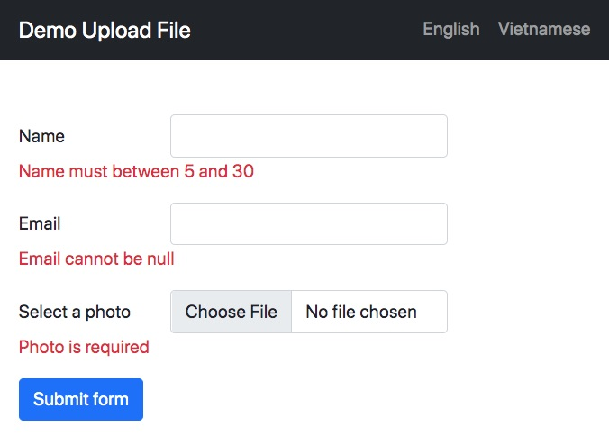
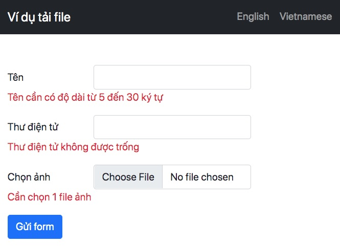
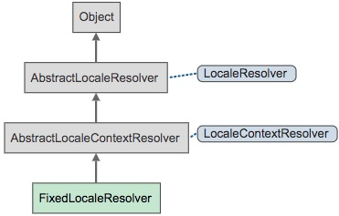
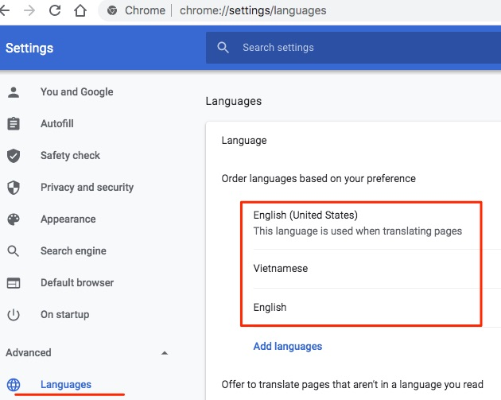
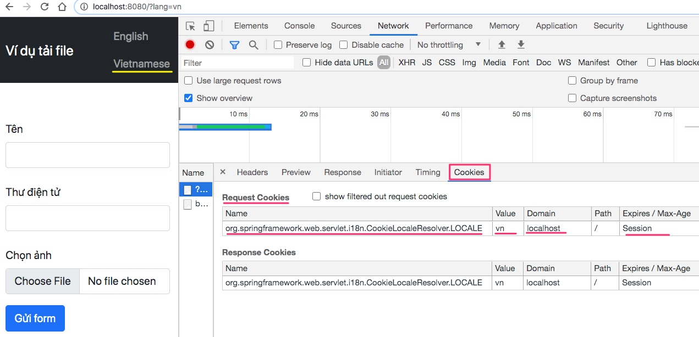

# Quốc tế hoá đa ngôn ngữ





## 01. Các bước chuyển đổi ngôn ngữ và lưu lựa chọn ngôn ngữ

1. Cấu hình đa ngôn ngữ trong file application.properties hoặc application.yml: nơi nào lưu string đa ngôn ngữ, ngôn ngữ mặc định hiển thị là gì...
2. Người dùng ấn vào đường link có tham số lang trong query string `/?lang=en` hoặc `/?lang=vn`
3. Bean `LocaleChangeInterceptor` sẽ đọc giá trị tham số này, sau đó trả về reponse cài Cookie có tên là `org.springframework.web.servlet.i18n.CookieLocaleResolver.LOCALE`
4. Bean `LocaleResolver` đọc cookie `org.springframework.web.servlet.i18n.CookieLocaleResolver.LOCALE` nếu nó có trong request trình duyệt gửi lên để biết xem người dùng chọn ngôn ngữ nào.
5. Trong tất cả các Thymeleaf view template không ghi trực tiếp các string nữa mà ghi các key để đọc ra string cho từng ngôn ngữ cụ thể.
6. Tạo ra các file chứa string cho từng ngôn ngữ `res.properties`, `res_vn.properties`

## 02. Cấu trúc ứng dụng demo

```
.
├── main
│   ├── java
│   │   └── vn
│   │       └── techmaster
│   │           └── demoupload
│   │               ├── config
│   │               │   └── LanguageConfig.java <-- Tạo bean lấy tuỳ chọn ngôn ngữ
│   ├── resources
│   │   ├── lang <-- Nơi lưu các message đa ngôn ngữ
│   │   │   ├── res_vn.properties <-- tiếng Việt
│   │   │   └── res.properties <-- tiếng Anh

│   │   ├── templates
│   │   │   ├── template.html <-- View template mẫu dùng chung
│   │   │   └── upload.html <-- View template Form upload hỗ trợ đa ngôn ngữ
│   │   └── application.properties <-- Cấu hình đa ngôn ngữ
```
## 03. Cấu hình đa ngôn ngữ ở application.properties
```
spring.messages.basename=lang/res
spring.mvc.locale-resolver=fixed
spring.mvc.locale=en
```
- `spring.messages.basename`: đường dẫn chưa các file string từng ngôn ngữ. `lang/res`: thư mục lang trong thư mục resources, file ngôn ngữ bắt đầu bằng `res`
- `spring.mvc.locale-resolver=fixed`: có loại ngôn ngữ web site tự thay đổi theo locale mà trình duyệt chọn. Còn loại `fixed` là do người dùng chủ động chọn
  

  Chọn ngôn ngư ưu tiên hiển thị trên trình duyệt. Đây là cách tôi không dùng trong ví dụ này. Tôi muốn người dùng chủ động chọn ngôn ngữ
  
- `spring.mvc.locale=en`: đặt ngôn ngữ mặc định là tiếng Anh.


## 04. Chọn ngôn ngữ qua đường link

Người dùng sẽ chọn ngôn ngữ qua đường link có bổ xung tham số `/?lang=en` cho tiếng Anh, `/?lang=vn` cho tiếng Việt

```html
<ul class="navbar-nav d-flex">
  <li class="nav-item">
    <a class="nav-link" th:href="@{/?lang=en}">English</a>
  </li>
  <li class="nav-item">
    <a class="nav-link" th:href="@{/?lang=vn}">Vietnamese</a>
  </li>        
</ul>
```
## 05. Bean component giúp xác định lựa chọn ngôn ngữ người dùng và cài đặt vào Cookie

File [LanguageConfig.java](src/main/java/vn/techmaster/demoupload/config/LanguageConfig.java)
```java
@Configuration
public class LanguageConfig implements WebMvcConfigurer {
  @Autowired private MessageSource messageSource;

  //Xác định ngôn ngữ người dùng chọn qua Cookie
  @Bean public LocaleResolver localeResolver() {
    CookieLocaleResolver localeResolver = new CookieLocaleResolver();
    localeResolver.setDefaultLocale(Locale.US);
    return localeResolver;
  }

  //Đọc giá trị ở tham số lang trong URL request
  @Bean public LocaleChangeInterceptor localeChangeInterceptor() {
    LocaleChangeInterceptor localeChangeInterceptor = new LocaleChangeInterceptor();
    localeChangeInterceptor.setParamName("lang");
    return localeChangeInterceptor;
  }

  @Override
  public void addInterceptors(InterceptorRegistry interceptorRegistry) {
    interceptorRegistry.addInterceptor(localeChangeInterceptor());
  }


  //Hỗ trợ đa ngôn ngữ các thông điệp báo lỗi trong Hibernate Validator
  @Bean public LocalValidatorFactoryBean validator(MessageSource messageSource) {
      LocalValidatorFactoryBean bean = new LocalValidatorFactoryBean();
      bean.setValidationMessageSource(messageSource);      
      return bean;
  }
}
```

## 06. Cookie lưu lựa chọn ngôn ngữ
`org.springframework.web.servlet.i18n.CookieLocaleResolver.LOCALE` là cookie dùng để lưu lựa chọn ngôn ngữ người dùng chọn.




## 07. File chứa các string đa ngôn ngữ
```
spring.messages.basename=lang/res
```

**res.properties**
```
demo_upload=Demo Upload File
name=Name
email=Email
select_photo=Select a photo
submit_form=Submit form
name_size_between_5_30=Name must between 5 and 30
email.cannot.null=Email cannot be null
email.invalid=Email is invalid
photo.required=Photo is required
```
**res_vn.properties**
```
demo_upload=Ví dụ tải file
name=Tên
email=Thư điện tử
select_photo=Chọn ảnh
submit_form=Gửi form
name_size_between_5_30=Tên cần có độ dài từ 5 đến 30 ký tự
email.cannot.null=Thư điện tử không được trống
email.invalid=Thư điện tử không hợp lệ
photo.required=Cần chọn 1 file ảnh
```

## 08. Nhúng string đa ngôn ngữ vào Thymeleaf
Cú pháp `#{key}` dùng lấy string trong file message resource đổ vào view template
```html
th:text="#{submit_form}"
```
Ở đây `submit_form` là key để lấy chuỗi ngôn ngữ tương ứng
```
submit_form=Gửi form
submit_form=Submit form
```

## 09. Đa ngôn ngữ trong báo lỗi validation
Để nhúng string đa ngôn ngữ trong báo lỗi validation hãy dùng cú pháp
` message = "{key}"`

```java
public class Person {
  @Size(min = 5, max = 30, message = "{name_size_between_5_30}")
  private String name;

  @NotBlank(message = "{email.cannot.null}")
  @Email(message = "{email.invalid}")
  private String email;

  private MultipartFile photo;
}
```

## 10. Đa ngôn ngữ trong Controller của Spring Boot
Bạn cần sử dụng Bean `MessageSource` và xác định locale người dùng chọn
```java
@Controller
public class UploadController {
  @Autowired private MessageSource messageSource;  //Component này chuyển để lấy string theo ngôn ngữ

  @GetMapping
  public String doSomething(Model model) {
    Locale locale = LocaleContextHolder.getLocale(); //Lấy ngôn ngữ người dùng chọn
    String message = messageSource.getMessage("key", null, "Defaul message when key not foud", locale); //Lấy string từ messageSource theo key và locale
    Model.addAttributes("message", message);
    return "page";
  }    
}
```

## 11. Còn những vấn đề gì nữa trong đa ngôn ngữ mà tôi chưa bàn đến?

1. Xử lý số ít, số nhiều: nhiều ngôn ngữ chia danh từ với số đếm ví dụ: one person, two people
2. Xử lý định dạng ngày tháng năm. Mỹ khác với châu Âu. Và Nhật cũng khác nốt.
3. Lưu đa ngôn ngữ vào CSDL quan hệ hoặc một microservice để cung cấp cho các service khác.
Lúc này cần tự lập trình một class tuân thủ interface `MessageSource`. Khi làm đến đây các bạn hãy cảm ơn tác giả viết Spring Boot vì họ luôn thiết kế framework theo quy tắc "Programming against interface not against concrete class"
4. Nếu bạn thấy bài viết này hữu ích hãy đăng ký ngay khoá học lập trình Fullstack Java ở Techmaster nhé.