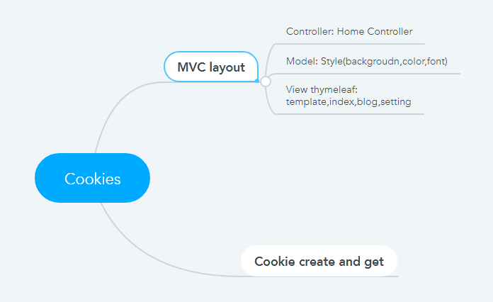

//Phần lý thuyết
1. Mục đích của Cookie: Mục đích của cookie là để lưu trữ tạm thời các thông tin theo dạng key:value nhằm phía Server nhận diện theo dõi các thông tin của client để gửi những thông tin mà không cần xác mình hay đăng nhập lại
2. Cookie là công nghệ chỉ có trong Spring Boot. Đúng hay Sai?
- Sai vì cookie được dùng trong các ứng dụng trình duyệt web
3. Thuộc tính Expires/Max*Age tính bằng đơn vị gì? Ý nghĩa của nó là gì?
- Tính bằng đơn vị giây, là thời gian tồn tại của cookie đó trên client.
4. Thuộc tính Domain của Cookie có ý nghĩa gì?
- là domain mà cookies chúng ta được hợp lệ, mọi thứ được gửi hoặc được sử dụng từ domain này sẽ kèm theo cookies
5. Thuộc tính nào cho phép mã JavaScript ở client có thể đọc được giá trị của Cookie?
- Thuộc tính HttpOnly. False: JS có thể đọc được, True thì không.
6. Thuộc tính Path có tác dụng như thế nào?
- Path: đường dẫn được chỉ định trong domain, nơi mà cookies sẽ được gửi đến server. Nó có thể là trống nếu bạn muốn thu nhận cookie từ bất kỳ thư mục hoặc trang nào

//Phần thực hành
1. Cấu trúc chương trình
   
    
   

2. Chạy chương trình:
    
   
   
    
        
        
        
   
