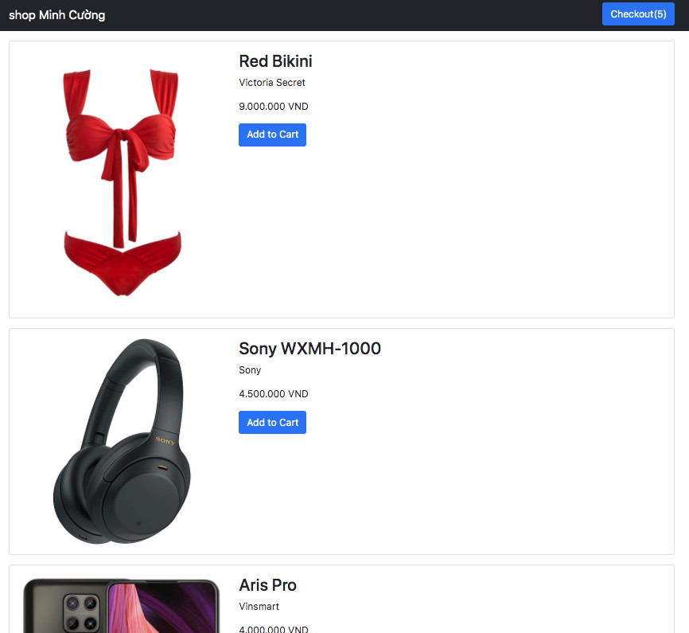
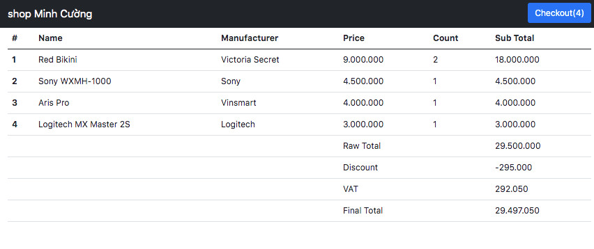

# Tài liệu tham khảo về Session

Dự án mẫu sử dụng Session JDBC tôi đã [hoàn thành ở đây](shopingcart)

Lecture Notes dạng Mind Map để ở đây [LectureNode.pdf](LectureNode.pdf)

Các em nên xem kỹ hai bài viết dưới đây
- [Spring Boot + Session Management Hello World Example](https://www.javainuse.com/spring/springboot_session)
- [Spring Boot + Session Management Example(2021)](https://www.codeusingjava.com/boot/session)

**Bài tập về nhà:**

1. Chuyển từ Session JDBC sang Session Redis
2. Bổ xung chức năng xoá mặt hàng ra khỏi Shopping Cart
3. Bổ xung form nhập địa chỉ người nhận hàng gồm: họ tên, email, di động, địa chỉ nhận hàng
4. Người dùng ấn nút xác nhận gửi email tới người dùng

Thầy Quang sẽ code mẫu tiếp và chữa tất cả những bài này!
