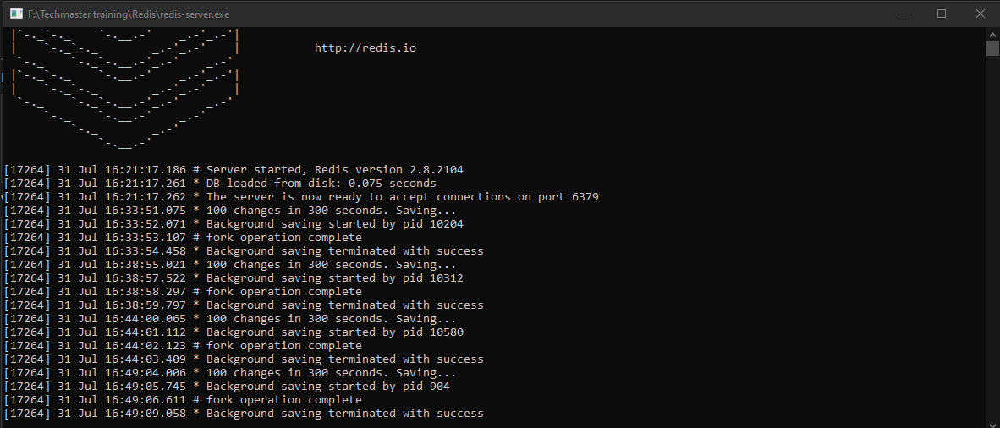
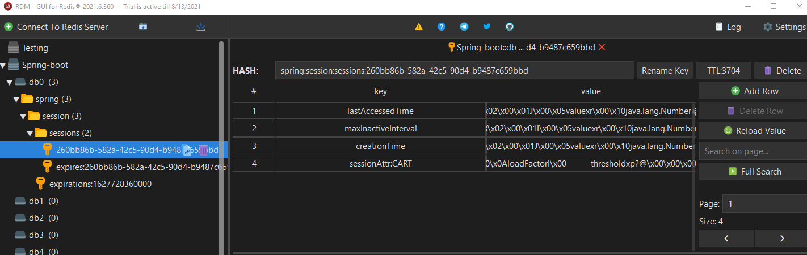
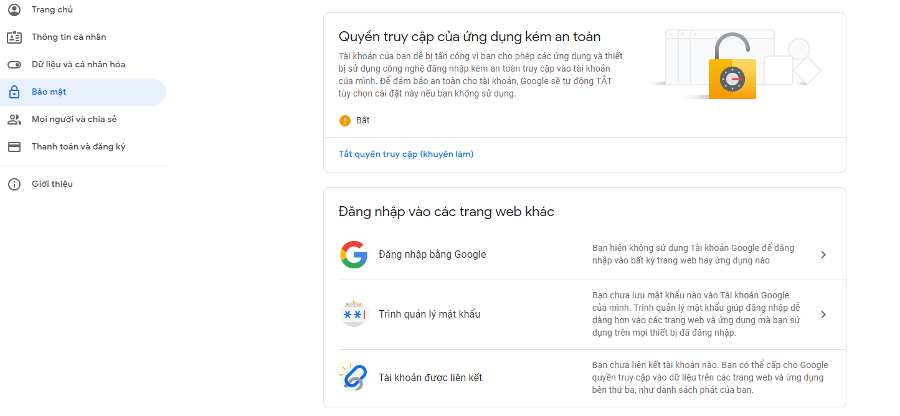
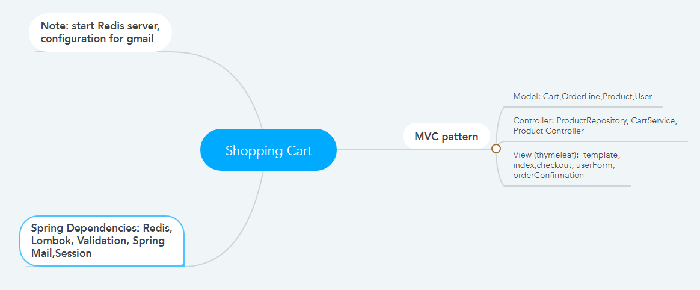
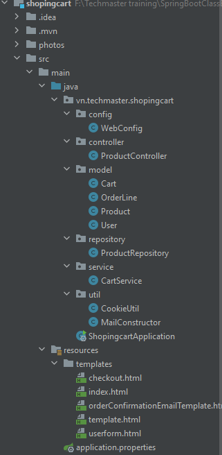
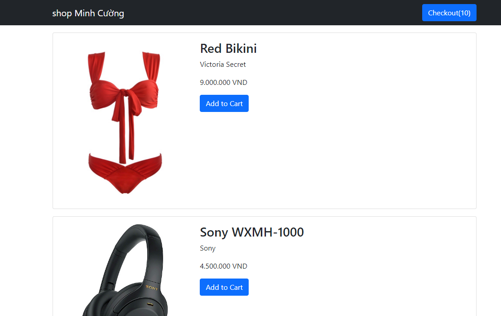
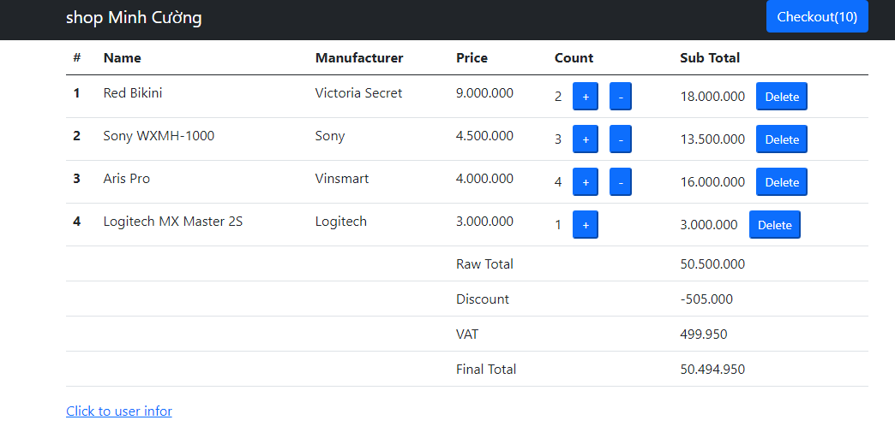
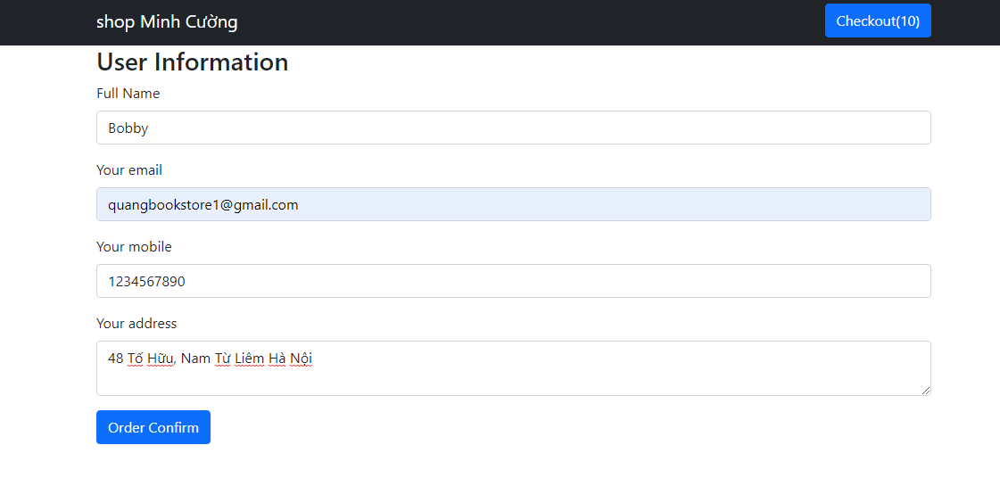
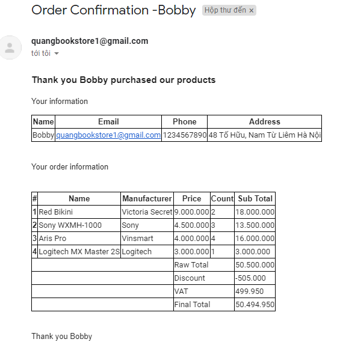

1. Lưu ý trước khi chạy chương trình:
- Cài đặt và chạy Redis Sever, cài đặt redis manager để theo dõi 

  
- Cài đặt google để nhận được request từ java: bật chức năng được truy cập từ third party 

  
2. Cấu hình và cài đặt chương trình

   
   
3. Chạy chương trình
- Trang index

  
- Trang checkout

  
- Trang userform

  
- Email đơn hàng nhận được

